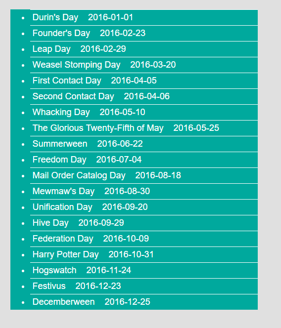

# Wykorzystywanie danych

> Odpowiedzi wpisz w odpowiednich plikach, chyba że treść polecenia wskazuje inaczej. Pamiętaj, żeby oddzielać ćwiczenia komentarzami i pisać czytelny, dobrze sformatowany kod. Jeśli polecenie w zadaniach brzmi: "Stwórz nową funkcję, w której wykonasz te czynności" to znaczy, że należy stworzyć funkcję. Nawet jeśli treści zadań są mało skomplikowane ucz się używać funkcji.

## Zadania do samodzielnego wykonania

# Zadanie 1 (~ 15min - 20min)

Pod adresem <https://holidayapi.com/> jest przechowywana baza świąt państwowych różnych krajów. Aby z niej skorzystać trzeba wygenreować swój klucz API - wejdź na stronę i wygeneruj swój klucz.

Za pomocą funkcji `ajax()` wczytaj do elementu **ul** wszystkie daty świąt (jako elementy li). Aby poprawnie wczytać dane w funkcji `ajax()` trzeba przekazać wymagane parametry, o których mowa na stronie. **Uwaga** - daty mogą być tylko historyczne (nie bierzący rok).

Każdą nazwę święta wczytaj do elementu **li**, jego datę również wczytaj do elementu **li** jako **span**.

Podpowiedzi:

- Wczytaj dane i zobacz w konsoli jak wyglądają, pozwoli Ci to ustalić czego należy użyć, aby dostać się do nazw i dat świąt

Po wczytaniu widok może wyglądać tak. Możesz go dowolnie sformatować, to tylko przykład.

